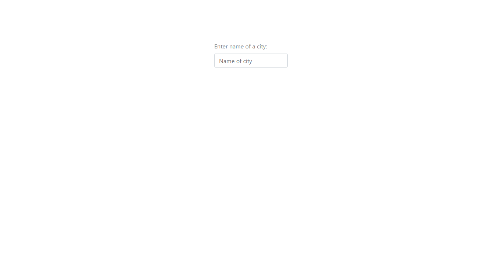
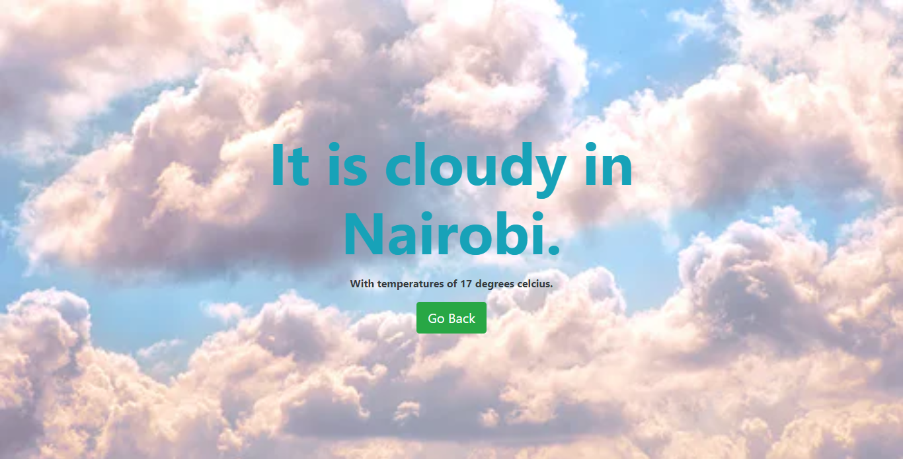

### Weather Application

## Description

A simple weather forecast site that uses data from the open weather [api](https://openweathermap.org/), 
to display weather conditions of a location. The background of the page changes depending on the weather condition of a location.





## Built with

- Javascript
- HTML & CSS
- Webpack

## Live Demo 

[Website link](https://rawcdn.githack.com/blackpintz/WeatherApp/1787fdc2bd055afcd688018db004d4a2f914fcb3/dist/index.html)

## Getting Started

To get a local copy up and running follow these simple example steps.

## Prerequisites

- Install node.

## Set up

- Clone the project.
- Cd into the project directory.
- Run ```npm install``` .
- Run ```npm run build```.


## Author

- Github: [@blackpintz](https://github.com/blackpintz)
- Twitter: [@blackpintz](https://twitter.com/blackpintz)


## 🤝 Contributing

Contributions, issues and feature requests are welcome!

Feel free to check the [issues page](https://github.com/blackpintz/WeatherApp/issues).

## Show your support

Give a ⭐️ if you like this project!

## Acknowledgments

- [Microverse](https://www.microverse.org/)
- [OpenWeather](https://openweathermap.org/)


